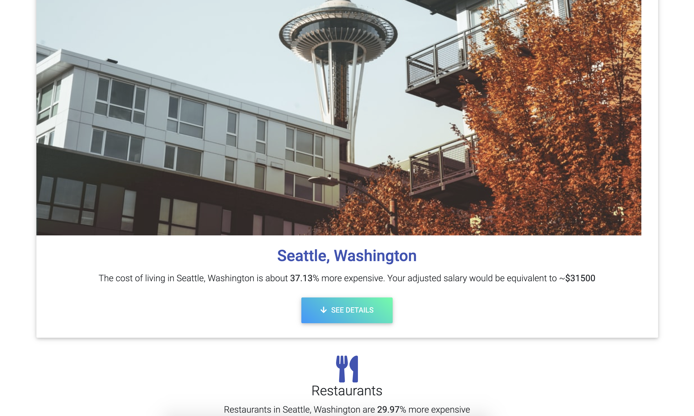

<!-- PROJECT LOGO -->
<br />
<p align="center">
  <a href="https://github.com/abdenny/Relocatable">
    
  </a>

  <h3 align="center">Relocatable</h3>

  <p align="center">
    Relocatable determines how a user’s salary fares relative to the cost of living across America.
    <br />
    <br />
    <br />.
    <a href="https://compassionate-hawking-cfeb4d.netlify.app">View Live</a>
    ·
    <a href="https://www.youtube.com/watch?v=42JPzOr9kRY">View Demo</a>
    ·
  </p>
</p>

<!-- TABLE OF CONTENTS -->

## Table of Contents

- [About the Project](#about-the-project)
  - [Built With](#built-with)
- [Usage](#usage)
- [Getting Started](#getting-started)
  - [Prerequisites](#prerequisites)
  - [Installation](#installation)

* [Contributing](#contributing)
* [Contact](#contact)

<!-- ABOUT THE PROJECT -->

## About The Project

 

### Built With

<h3>Tech:</h3>

- React
- Redux
- React Router
- Material UI
- React Bootstrap

<h3>APIs:</h3>

- Numbeo
- Unsplash

<!-- USAGE EXAMPLES -->

## Usage

<p align="center">
  
   
  
</p>

<h4>Relocatable allows users to search for cities, input their salary, and to see their cost of living there. Relocatable was designed mobile-first with functionality, responsiveness, and a smooth user experience at the forefront.

<h3>MVP (Minimum Viable Product):</h3>
<ul>
    <li>Use React Router to make routes on the SPA</li>
    <li>Lift up state between input and form components, writing parent state to redux store</li>
    <li>Making multiple API calls to populate view page</li>
    <li>Responsive design on all devices</li>
</ul>

</br>

<h3>Stretch Goals Completed</h3>
<ul>
    <li>Further dividing the Numbeo API results into subcategories, and displaying these results in their own components</li>
    <li>Animating components mounting and unmounting</li>
    <li>Adding an About page</li>
</ul>

</br>
 

<!-- GETTING STARTED -->

## Getting Started

To get a local copy up and running follow these simple steps.

### Prerequisites

This is an example of how to list things you need to use the software and how to install them.

- npm

```sh
npm install npm@latest -g
```

### Installation

1. Clone the Relocatable

```sh
git clone https://github.com/abdenny/Relocatable.git
```

2. Install NPM packages

```sh
npm install
```

<!-- CONTRIBUTING -->

## Contributing

Any contributions you make are **greatly appreciated**.

1. Fork the Project
2. Create your Feature Branch (`git checkout -b feature/AmazingFeature`)
3. Commit your Changes (`git commit -m 'Add some AmazingFeature'`)
4. Push to the Branch (`git push origin feature/AmazingFeature`)
5. Open a Pull Request

<!-- CONTACT -->

## Contact

Austin Denny - [Email](mailto:austinbdenny@gmail.com)

Project Link: [https://github.com/abdenny/Relocatable](https://github.com/abdenny/Relocatable)
